# Plano — Análise pós-recorte SIMCAR de AUAS (2003–2008)

Status: **planejamento; nenhuma implementação desta análise foi feita ainda**

Escopo: primeira fase da reescrita do analista pós-recorte

Última revisão: 2026-07-30

## 1. Objetivo recuperado da sessão anterior

Reescrever do zero a primeira etapa do analista que roda depois do recorte SIMCAR
gerado a partir da ATP:

- analisar **cada polígono classificado pelo recorte como AUAS**;
- consultar as imagens da SEMA-MT:
  - Landsat 5 de 2003, 2004, 2005, 2006 e 2007;
  - SPOT de 2008;
- usar a **Groq somente para visão**, com `qwen/qwen3.6-27b`;
- usar o **DeepSeek V4 Pro para o processamento textual e a redação**;
- avisar o usuário quando houver evidência de antropização/desmate anterior a 2008;
- manter o resultado auditável, testável e explícito quando for inconclusivo.

Neste plano, AUAS segue a nomenclatura do próprio projeto: **Área de Uso
Antropizado do Solo**. O resultado é um alerta técnico de apoio. Ele não deve
afirmar, sozinho, que existe infração, passivo ou regularidade jurídica.

## 2. Baseline confirmado

### Código atual

- A lógica pós-recorte está concentrada em `backend/simcar-clip.ts`.
- Os polígonos recortados estão em
  `CachedJob.clippedGeometries.get("AUAS")`, mas o fluxo atual une todos eles
  antes da análise.
- O fluxo AUAS atual analisa 2008–2024, isto é, a janela oposta à desta fase.
- O resultado atual depende de texto livre e regex como
  `extractAuasYearVerdict` e `extractFirstDeforestationYearFromText`.
- O endpoint e o frontend já se comunicam por SSE em
  `POST /api/simcar/clip/analyze-auas`.
- O frontend e o PDF ainda exibem conceitos do fluxo antigo, como
  `passivoAmbiental`, “supressão pós-2008” e `AUAS_VALIDA`.
- Há um cliente DeepSeek V4 Pro testado no módulo de autofix. Ele serve como
  referência de transporte, timeout, validação e testes, mas não deve ser
  acoplado ao novo domínio.

### Validações ao vivo feitas em 2026-07-30

- O GetCapabilities da SEMA retornou as camadas
  `Mosaicos:LANDSAT_5_2003` até `Mosaicos:LANDSAT_5_2007` e
  `Mosaicos:MOSAICO_SPOT_SEPLAN`.
- GetMap real retornou PNG válido para Landsat 2003, Landsat 2007 e SPOT.
- `qwen/qwen3.6-27b` analisou uma cena Landsat real.
- `reasoning_effort: "none"` eliminou o bloco `<think>` e retornou resposta
  direta.
- A API rejeitou 4 e 5 imagens e aceitou no máximo **3 imagens por chamada**.
- Uma chamada com 3 cenas consumiu 5.478 tokens de entrada.
- Os headers da conta indicaram limite de 8.000 tokens/minuto para o modelo.

O limite operacional deve ser fixado em 3, mesmo que alguma página genérica da
documentação ainda mencione 5. A página específica do modelo também informa 3:

- https://console.groq.com/docs/model/qwen/qwen3.6-27b
- https://console.groq.com/docs/rate-limits
- https://api-docs.deepseek.com/news/news260424/

## 3. Decisões não negociáveis

1. **Groq não redige o laudo.** Ela recebe apenas texto de instrução e imagens,
   e devolve observações visuais estruturadas.
2. **DeepSeek não recebe imagens.** Ele recebe somente geometrias resumidas,
   metadados, observações visuais validadas e a decisão determinística.
3. **A decisão de alertar não fica a cargo de texto livre de LLM.** Código
   determinístico reduz as evidências validadas para um status.
4. **Nenhuma ausência vira “sem desmate”.** Cena ausente, coberta, ilegível ou
   resposta inválida produz `INCONCLUSIVO`.
5. **Não inventar ano exato.** O sistema relata “já visível em 2003” ou
   “mudança observada entre 2005 e 2006”; mosaicos anuais não provam uma data.
6. **2008 exige cautela.** Mudança entre Landsat 2007 e SPOT 2008 não prova de
   que lado de 22/07/2008 ocorreu. O resultado deve ser
   `INCONCLUSIVO_NO_MARCO_2008`, nunca “pré-marco” por suposição.
7. **Um polígono, um resultado.** O agregado da propriedade é derivado dos
   resultados individuais; não substitui a análise por polígono.
8. **Sem segredo no código, logs, fixtures ou SSE.** Chaves entram somente por
   variáveis de ambiente no backend.
9. **O contrato existente só muda de forma versionada.** A nova resposta usa
   `schemaVersion: 2`; migração de UI, PDF e persistência acontece junto.
10. **Falhas são retomáveis.** O job persiste checkpoints por polígono e janela,
    respeita cancelamento e não repete chamadas concluídas.

## 4. Arquitetura alvo

```mermaid
flowchart LR
    A[Job do recorte SIMCAR] --> B[Extrator de polígonos AUAS]
    B --> C[ID, hash, área e bbox por polígono]
    C --> D[Gerador WMS 2003–2008]
    D --> E[Overlay e controle de qualidade]
    E --> F[Fila Groq Vision<br/>máx. 3 imagens]
    F --> G[Observações JSON validadas]
    G --> H[Redutor determinístico]
    H --> I[Status e alerta por polígono]
    I --> J[DeepSeek V4 Pro<br/>síntese textual]
    J --> K[SSE + persistência + PDF + UI]
```



### 4.1 Limites de módulo

A implementação deve sair do monólito. Estrutura proposta:

```text
backend/analise-pos-recorte/
  config.ts
  types.ts
  schemas.ts
  auas-polygons.ts
  wms-scenes.ts
  image-quality.ts
  groq-vision-client.ts
  deepseek-text-client.ts
  evidence-reducer.ts
  report-builder.ts
  orchestrator.ts
  index.ts
```

`backend/simcar-clip.ts` fica como adaptador temporário:

- hidrata o job;
- chama o novo orquestrador;
- converte progresso para o SSE existente;
- persiste o resultado;
- gera o PDF;
- envia `complete`.

Funções WMS úteis hoje são privadas. A implementação deve extraí-las com testes,
sem duplicar URL, retry, overlay e validação de imagem:

- `buildWmsGetMapUrl`;
- `fetchWmsImageBuffer`;
- `calculateDynamicResolution`;
- `calculateWmsTimeout`;
- `buildPolygonOverlaySvg`;
- `compositeOverlay`;
- `detectCloudCover`;
- `compressForVision`.

### 4.2 Identidade do polígono

Cada geometria de `clippedGeometries.get("AUAS")` recebe:

- `polygonId`: `AUAS-0001`, `AUAS-0002`, ...;
- `geometryHash`: SHA-256 de uma representação GeoJSON canônica;
- `sourceIndex`;
- área em hectares;
- bbox;
- centroide apenas para exibição;
- geometria original em EPSG:4674.

O hash, e não somente o índice, deve identificar o polígono nos checkpoints.
Polygon e MultiPolygon, anéis internos e partes disjuntas precisam ser
preservados.

### 4.3 Cena por ano

Para cada polígono, gerar exatamente uma cena comparável por fonte:

| Ordem | Fonte | Camada padrão |
|---:|---|---|
| 1 | Landsat 5 — 2003 | `Mosaicos:LANDSAT_5_2003` |
| 2 | Landsat 5 — 2004 | `Mosaicos:LANDSAT_5_2004` |
| 3 | Landsat 5 — 2005 | `Mosaicos:LANDSAT_5_2005` |
| 4 | Landsat 5 — 2006 | `Mosaicos:LANDSAT_5_2006` |
| 5 | Landsat 5 — 2007 | `Mosaicos:LANDSAT_5_2007` |
| 6 | SPOT — 2008 | `Mosaicos:MOSAICO_SPOT_SEPLAN` |

Regras:

- bbox, orientação, proporção, resolução e estilo iguais em toda a série;
- contorno AUAS visível e fino;
- contexto mínimo ao redor do polígono;
- rótulo de ano e fonte gravado na imagem e repetido no prompt;
- sem misturar duas vistas do mesmo ano no MVP;
- validar magic bytes, dimensões, tamanho, imagem uniforme e possível oclusão;
- registrar URL WMS sem `authkey`, checksum, dimensão e score de qualidade;
- permitir aliases e override por env, como o catálogo atual.

### 4.4 Janelas de visão

O MVP prioriza confiabilidade temporal e usa janelas sobrepostas:

1. `2003, 2004, 2005`;
2. `2005, 2006, 2007`;
3. `2007, SPOT 2008`.

Assim, todas as cenas são vistas e as fronteiras 2005/2006 e 2007/2008 não
dependem de memória entre requisições.

Cada chamada deve:

- usar `qwen/qwen3.6-27b`;
- usar `reasoning_effort: "none"`;
- aceitar no máximo 3 imagens por asserção local antes da requisição;
- pedir JSON no schema definido em [CONTRATOS.md](./CONTRATOS.md);
- ter timeout e no máximo uma tentativa de reparo/repetição;
- registrar uso, modelo, request ID e headers de rate limit, sem payload sensível.

Com o limite observado, o processamento deve ser serializado por organização e
guiado por `x-ratelimit-remaining-tokens`, `x-ratelimit-reset-tokens` e
`retry-after`. A estimativa inicial é de aproximadamente 2–3 minutos por
polígono. O painel precisa mostrar uma previsão honesta.

Depois do MVP, uma otimização com folhas de contato pode ser avaliada. Ela só
entra se um conjunto dourado demonstrar paridade; não deve ser adotada apenas
para reduzir custo.

### 4.5 Redução determinística

O redutor usa somente JSON validado e qualidade de cena:

- `ALERTA_PRE_2008`:
  - antropização já é observável em 2003; ou
  - há transição confirmada entre dois anos de 2003 a 2007;
- `SEM_EVIDENCIA_PRE_2008`:
  - todas as cenas obrigatórias são utilizáveis;
  - não há transição nem antropização prévia observável;
- `INCONCLUSIVO_NO_MARCO_2008`:
  - a única mudança aparece entre 2007 e SPOT 2008;
- `INCONCLUSIVO`:
  - faltam cenas, há oclusão, conflito entre janelas, baixa confiança ou JSON
    inválido após retry.

O agregado da propriedade é:

- `ALERTA_PRE_2008` se pelo menos um polígono tem alerta;
- `INCONCLUSIVO` se não há alerta, mas pelo menos um polígono é inconclusivo;
- `SEM_EVIDENCIA_PRE_2008` apenas se todos os polígonos são conclusivos e sem
  alerta.

O sistema guarda também o intervalo observado, nunca apenas um “ano provável”.

### 4.6 Papel do DeepSeek

Modelo padrão: `deepseek-v4-pro`.

Entrada:

- identificação e área dos polígonos;
- fontes/anos realmente usados e ausentes;
- evidência estruturada das janelas;
- resultado determinístico por polígono e agregado;
- limitações técnicas;
- contexto AC/AVN já disponível, quando houver.

Saída validada:

- resumo executivo;
- seção por polígono;
- alertas;
- limitações;
- recomendações de revisão humana;
- referências internas aos IDs das evidências.

O DeepSeek não pode:

- alterar status, intervalo, área ou confiança calculados;
- declarar infração/passivo;
- afirmar que viu uma imagem;
- preencher dado ausente;
- receber URL de imagem ou base64.

Se o DeepSeek falhar, o sistema preserva o resultado estruturado e gera um
relatório determinístico simples. Não deve chamar um modelo de texto da Groq.

## 5. Fases de implementação

### Fase 0 — Congelar contrato e conjunto dourado

- selecionar, com revisão técnica humana, ao menos 12 polígonos:
  - antropizado antes/já em 2003;
  - mudança clara entre anos pré-2008;
  - sem mudança;
  - mudança apenas na transição 2007/SPOT 2008;
  - nuvem/oclusão;
  - polígono pequeno;
  - MultiPolygon;
  - cena ausente;
- guardar manifestos e hashes, nunca chaves;
- registrar o veredito esperado e a justificativa humana;
- medir tokens e tempo nas resoluções candidatas.

Saída: fixture manifest versionado e critérios de qualidade fechados.

### Fase 1 — Tipos, schemas e redutor puro

- criar os contratos V2;
- implementar o redutor determinístico;
- implementar hash/ID por geometria;
- cobrir tudo com unit tests.

Saída: domínio testável sem rede e sem LLM.

### Fase 2 — Cenas WMS por polígono

- extrair os helpers WMS do monólito;
- gerar as seis cenas comparáveis;
- aplicar overlay e checks de qualidade;
- criar preflight de GetCapabilities/GetMap;
- persistir proveniência sanitizada.

Saída: série de imagens completa sem chamar IA.

### Fase 3 — Cliente Groq Vision

- implementar cliente isolado e injetável;
- impor teto de 3 imagens;
- implementar JSON mode/schema;
- controlar 429 por headers e relógio injetável;
- checkpoint por janela;
- validar no conjunto dourado.

Saída: evidência visual estruturada por polígono.

### Fase 4 — Cliente DeepSeek e laudo

- criar cliente textual de domínio, inspirado no cliente do autofix;
- usar `deepseek-v4-pro` por padrão;
- validar saída e referências de evidência;
- implementar fallback determinístico.

Saída: laudo fiel ao resultado, sem Groq textual.

### Fase 5 — Orquestrador, SSE e persistência

- integrar no `analyze-auas`;
- emitir progresso por polígono/janela;
- persistir checkpoints e permitir retomada;
- versionar `auasMeta.schemaVersion = 2`;
- garantir que `complete` só saia depois da persistência durável.

Saída: backend integrado e retomável.

### Fase 6 — Frontend e PDF

- substituir badges de “AUAS válida/passivo pós-2008”;
- mostrar status pré-2008 por polígono;
- mostrar fontes usadas, ausentes, intervalo e limitações;
- atualizar Resumo Executivo do PDF;
- manter leitura de cards V1 antigos;
- remover interpretação V1 somente após migração.

Saída: UI e relatório alinhados ao novo significado.

### Fase 7 — E2E, rollout e remoção do legado

- executar a matriz de [TESTES.md](./TESTES.md);
- ativar em desenvolvimento por feature flag;
- comparar V2 com conjunto dourado;
- ativar para produção;
- observar erros, latência e gasto;
- remover o caminho AUAS 2008–2024 antigo após a janela de rollback.

Saída: V2 como único fluxo AUAS novo.

## 6. Configuração planejada

```dotenv
# já existentes
GROQ_API_KEY=
DEEPSEEK_API_KEY=
SEMA_WMS_BASE_URL=
SEMA_WMS_AUTHKEY=

# novas
SIMCAR_AUAS_V2_ENABLED=false
SIMCAR_AUAS_VISION_MODEL=qwen/qwen3.6-27b
SIMCAR_AUAS_TEXT_MODEL=deepseek-v4-pro
SIMCAR_AUAS_VISION_MAX_IMAGES=3
SIMCAR_AUAS_VISION_REASONING_EFFORT=none
SIMCAR_AUAS_VISION_TIMEOUT_MS=120000
SIMCAR_AUAS_DEEPSEEK_TIMEOUT_MS=90000
SIMCAR_AUAS_MAX_POLYGONS_PER_JOB=0
```

`SIMCAR_AUAS_MAX_POLYGONS_PER_JOB=0` significa sem corte silencioso. Se for
adotado limite de produto, o endpoint deve recusar antes de cobrar/processar e
informar o usuário; nunca analisar apenas os primeiros polígonos.

## 7. Mudanças de contrato e migração

Manter:

- endpoint `POST /api/simcar/clip/analyze-auas`;
- SSE `job_started`, `progress`, `billing`, `report_error`, `error`, `complete`;
- `analysis`, `images`, campos do PDF e autenticação.

Alterar de forma versionada:

- adicionar `schemaVersion: 2`;
- substituir `yearVerdicts` por evidências por polígono;
- substituir `firstDeforestationYear` por intervalo observado;
- substituir `passivoAmbiental` por `pre2008Alert`;
- substituir `finalStatus` por `pre2008Status`;
- não emitir `model_thinking` no fluxo novo.

Cards V1 continuam legíveis. Novos cards nunca devem preencher campos V1 com
semântica falsa apenas para satisfazer tipos antigos.

## 8. Riscos principais e mitigação

| Risco | Mitigação |
|---|---|
| 8k TPM torna muitos polígonos lentos | fila, ETA, checkpoint, retomada e benchmark de resolução |
| Polígono menor que a resolução Landsat | contexto/zoom calibrado e resultado inconclusivo quando não observável |
| SPOT 2008 não prova lado do marco de 22/07 | status específico inconclusivo no marco |
| LLM confunde paleta de mosaicos | prompt por fonte, conjunto dourado e JSON de evidência, sem decisão livre |
| Cenas de anos diferentes desalinhadas | bbox/dimensão/overlay idênticos e checksums |
| Resposta JSON inválida | schema estrito, uma repetição e depois inconclusivo |
| 429 ou queda após chamadas caras | headers de rate limit, checkpoint por janela e idempotência |
| Propriedades WFS foram descartadas | ID/hash sintético agora; preservar properties em etapa futura |
| UI/PDF ainda têm semântica pós-2008 | migração conjunta antes de habilitar V2 |
| Chave exposta em prompt anterior | revogar/rotacionar e manter somente no env do backend |

## 9. Fora do escopo desta primeira fase

- análise pós-2008;
- detecção por SCCON, que começa em 2019 e não valida 2003–2008;
- reintrodução do PRODES apagado;
- comparação raster determinística de pixels;
- classificação legal automática;
- mudança do analista AC/AVN;
- envio de imagens ao DeepSeek;
- deploy antes da aprovação do conjunto dourado.

## 10. Definição de pronto

A fase só está pronta quando:

- todos os polígonos AUAS recebem resultado individual;
- as seis fontes são tentadas e ausências ficam registradas;
- nenhuma chamada Groq excede 3 imagens;
- Groq é usada apenas para visão;
- DeepSeek V4 Pro é o único LLM textual;
- alerta e intervalo são derivados por código;
- mudança 2007→SPOT 2008 não é chamada de pré-2008;
- jobs retomam sem repetir janelas concluídas;
- SSE, persistência, PDF e UI concordam;
- cards V1 antigos continuam abrindo;
- testes unitários, integração, contrato, live e E2E passam;
- conjunto dourado atinge os critérios de [TESTES.md](./TESTES.md);
- nenhuma chave aparece no Git, logs, payload persistido ou frontend.
