# Plano — Fase 2: datação de desmatamento pós-2008 em AUAS

Status: **planejamento**  
Dependência: análise AUAS pré-2008 já implementada em
`backend/analise-pos-recorte/`  
Fixture oficial de validação: `SIMCAR_Recorte_Digital.zip` nesta mesma pasta  
Última revisão: 2026-07-31

## 0. Contrato da Fase 1 — retorno obrigatório de evidência pré-2008

A Fase 2 não substitui nem dilui o resultado da análise já implementada para
2003–2008. Ao terminar a Fase 1, o usuário deve receber, por polígono AUAS e
no agregado do imóvel, o status e a explicação da evidência pré-2008.

Em especial, se a série identificar que um AUAS já estava antropizado em 2003
ou que a transição ocorreu entre dois mosaicos de 2003 a 2007, a interface,
SSE, relatório e PDF devem devolver explicitamente:

```text
Evidência de desmate/antropização anterior a 2008
```

acompanhada do ano ou intervalo observado, confiança, cenas usadas e
limitações. O texto não pode ser apenas interno/técnico nem ser trocado por
“sem evidência” no resumo da propriedade. A formulação é evidência visual
técnica, não conclusão jurídica.

O arquivo `SIMCAR_Recorte_Digital.zip` é o caso de regressão obrigatório:
segundo a validação de negócio, o recorte gerado a partir dele contém ao menos
um AUAS com evidência pré-2008. Portanto, o E2E da Fase 1 deve falhar se não
retornar pelo menos um `ALERTA_PRE_2008` para esse caso.

## 1. Objetivo

Depois de concluir a análise pós-recorte já existente (série 2003–2008), o
sistema deverá analisar cada polígono AUAS com os mosaicos **Landsat da SEMA-MT
via WMS**, a partir de 2009, para identificar a primeira evidência observável
de conversão de vegetação nativa para uso antrópico/desmate.

O resultado por polígono deve retornar:

- o ano da primeira mudança confirmada, quando a série permitir essa conclusão;
- ou o intervalo fechado em que a mudança ocorreu, quando só for possível
  comparar anos não consecutivos;
- ou `INCONCLUSIVO`, quando faltarem cenas utilizáveis ou houver conflito nas
  evidências.

Este é um apoio técnico de interpretação de imagens. Não declara infração,
regularidade, passivo ambiental ou a data jurídica do evento.

## 2. Premissas e limites

1. **Fase sequencial.** A Fase 2 só é enfileirada após a Fase 1 terminar. O
   resultado pré-2008 permanece imutável e auditável.
2. **Unidade de análise.** Um resultado para cada polígono AUAS — nunca usar a
   união de todos os polígonos como substituto.
3. **Fonte.** Usar somente as camadas Landsat publicadas pela SEMA no WMS
   configurado. A primeira entrega deve descobrir o catálogo real com
   `GetCapabilities`; não codificar anos/layers ainda não verificados.
4. **Marco temporal.** A primeira cena pós-marco deve ser de 2009. A cena SPOT
   2008 da Fase 1 pode ser exibida apenas como referência visual, sem ser usada
   para afirmar que o evento ocorreu antes ou depois de 22/07/2008.
5. **Precisão honesta.** “Ano 2014” exige evidência de vegetação no ano
   anterior utilizável e antropização em 2014. Sem essa continuidade, usar
   “entre 2012 e 2014”.
6. **Ausência não é prova.** Nuvem, borda ruim, imagem uniforme, layer ausente,
   falha WMS ou discordância de análise resultam em `INCONCLUSIVO`.
7. **Decisão determinística.** A IA de visão produz observações estruturadas;
   código validado calcula o ano/intervalo. O modelo textual apenas redige o
   relatório a partir do resultado já decidido.
8. **Sem segredos.** URLs e registros persistidos nunca armazenam `authkey` ou
   outras credenciais da SEMA.

## 3. Resultado funcional esperado

Para cada AUAS, a tela e o relatório mostram uma das situações abaixo.

| Situação | Exibição | Regra mínima |
|---|---|---|
| Mudança anual confirmada | `Primeira evidência de desmatamento: 2014` | 2013 utilizável com vegetação nativa e 2014 utilizável com antropização; confirmação suficiente nas janelas adjacentes. |
| Mudança em intervalo | `Mudança observada entre 2012 e 2014` | último ano utilizável nativo e primeiro ano utilizável antrópico não são consecutivos. |
| Já antropizada na primeira cena disponível | `Já antropizada em 2009; início anterior não datável nesta fase` | 2009 utilizável e antrópica, sem data pós-2008 confirmável. |
| Sem mudança observada | `Sem mudança pós-2008 observada na série utilizável` | toda a série disponível e utilizável não aponta transição. |
| Inconclusiva | `Não foi possível datar com segurança` | falta, oclusão, baixa qualidade ou conflito impede a regra acima. |

O agregado do imóvel deve informar contagens e área por situação, sem ocultar
os resultados individuais.

## 4. Arquitetura proposta

```mermaid
flowchart LR
  A[Fase 1 concluída] --> B[Extrair AUAS e resultados V2]
  B --> C[Descobrir catálogo WMS SEMA]
  C --> D[Buscar e qualificar cenas Landsat 2009+]
  D --> E[Janelas temporais de até 3 imagens]
  E --> F[Groq Vision: observações JSON]
  F --> G[Validação de schema]
  G --> H[Redutor determinístico de cronologia]
  H --> I[DeepSeek: relatório técnico]
  I --> J[SSE, persistência, UI e PDF]
```



O novo domínio fica isolado do fluxo pré-2008, mas reaproveita seus contratos,
fila, checkpoints, qualidade de imagem e clientes já testados:

```text
backend/analise-pos-recorte/
  post2008/
    catalog.ts              # GetCapabilities, aliases e anos disponíveis
    wms-scenes.ts           # GetMap por ano e proveniência
    timeline.ts             # janelas, lacunas e ordenação temporal
    schemas.ts              # contratos Zod da Fase 2
    evidence-reducer.ts     # ano/intervalo/status determinísticos
    orchestrator.ts         # checkpoints, cancelamento e progresso
    report-builder.ts       # insumo factual para o texto/PDF
```

`backend/simcar-clip.ts` permanece adaptador de rota/job; não deve recuperar
lógica temporal por regex nem duplicar o cliente WMS.

## 5. Catálogo e imagens WMS

### 5.1 Descoberta obrigatória

Implementar uma rotina de catálogo que:

1. consulta o `GetCapabilities` do GeoServer SEMA;
2. extrai layers Landsat e o ano de cada uma;
3. normaliza aliases conhecidos, mas mantém o nome publicado como
   proveniência;
4. valida por `GetMap` uma amostra de cada ano antes de habilitá-lo;
5. armazena o catálogo com TTL e expõe diagnóstico administrativo.

O catálogo deverá declarar explicitamente anos ausentes. A disponibilidade
efetiva da SEMA determina a série da execução.

### 5.2 Comparabilidade

Para o mesmo AUAS, todas as imagens devem usar bbox, CRS, proporção, contexto,
dimensões e estilo equivalentes. O contorno do polígono deve ser fino e o rótulo
com ano/fonte aparece na imagem e no metadado da requisição.

Antes da visão, validar: HTTP, `Content-Type`/magic bytes de imagem, dimensões,
tamanho mínimo, uniformidade/contraste, possível nuvem/oclusão e cobertura do
polígono. A URL persistida é sanitizada.

## 6. Interpretação e decisão temporal

### 6.1 Observação visual

Reutilizar Groq Vision somente para visão e o mesmo limite seguro de **três
imagens por chamada**. Cada janela devolve JSON com estado por cena:

- `NATIVE_VEGETATION`;
- `ANTHROPIZED`;
- `MIXED`;
- `NOT_OBSERVABLE`;

e transição entre imagens consecutivas da janela. O modelo não recebe termos
jurídicos nem decide o ano final.

Janelas sugeridas para uma série anual contínua: `[2009, 2010, 2011]`,
`[2011, 2012, 2013]`, etc. A sobreposição permite conferir o ano compartilhado.
Uma estratégia de busca binária pode ser adicionada depois, apenas se mantiver
paridade com um conjunto dourado e não reduzir a auditabilidade.

### 6.2 Redutor determinístico

O redutor ordena somente cenas `USABLE` e aplica:

```text
NATIVE em Y-1 + ANTHROPIZED em Y, com confirmações compatíveis
  => CONFIRMADO_ANO, firstDetectedYear = Y

NATIVE em A + ANTHROPIZED em B, B > A + 1
  => CONFIRMADO_INTERVALO, observedInterval = [A, B]

ANTHROPIZED na primeira cena pós-2008 utilizável
  => JA_ANTROPIZADO_NO_INICIO_DA_SERIE

sem transição em toda a série exigida e utilizável
  => SEM_MUDANCA_OBSERVADA

qualquer lacuna crítica, conflito ou cena não observável
  => INCONCLUSIVO
```

“Desmate” no texto final significa **evidência visual de conversão** e deve
sempre trazer fonte, anos comparados, confiança e limitações.

## 7. Contrato de dados e APIs

Adicionar um bloco versionado ao resultado existente, sem quebrar a Fase 1:

```ts
type AuasPost2008Status =
  | "CONFIRMADO_ANO"
  | "CONFIRMADO_INTERVALO"
  | "JA_ANTROPIZADO_NO_INICIO_DA_SERIE"
  | "SEM_MUDANCA_OBSERVADA"
  | "INCONCLUSIVO";

type AuasPost2008Result = {
  schemaVersion: 1;
  phase: "POST_2008";
  polygonId: string;
  geometryHash: string;
  status: AuasPost2008Status;
  firstDetectedYear: number | null;
  observedInterval: { fromYear: number; toYear: number } | null;
  confidence: "HIGH" | "MEDIUM" | "LOW" | "INCONCLUSIVE";
  scenes: AuasScene[];
  evidence: string[];
  limitations: string[];
};
```

O endpoint deve iniciar um job assíncrono autenticado vinculado ao job de
recorte/Fase 1, retornar `202 { jobId }` e usar SSE com fase, polígono, janela,
progresso, ETA e estado de retomada. As novas rotas devem entrar tanto no
middleware `requireAuth` quanto na whitelist SSRF de `backend/index.ts`.

Persistir checkpoints por:

```text
jobId + geometryHash + rulesVersion + catalogVersion + imageSha256[] + windowId
```

Assim uma retomada não cobra novamente nem altera uma observação já concluída.

## 8. Experiência do usuário e relatório

- Após a conclusão da Fase 1, disponibilizar o botão explícito
  **“Iniciar Fase 2 — investigar desmatamento pós-2008”**. Não iniciar por
  padrão: o custo e o tempo variam com a quantidade de AUAS e anos disponíveis.
- Mostrar antes da execução: número de AUAS, anos Landsat encontrados,
  lacunas, estimativa de imagens/chamadas e aviso de interpretação técnica.
- Durante a execução: polígono e janela em análise, andamento real e opção de
  cancelar com retomada posterior.
- Ao concluir: tabela por polígono, área, status, ano/intervalo, confiança,
  fontes e limitações; filtros para confirmados, intervalo e inconclusivos.
- O PDF inclui metodologia, catálogo WMS/versão, hashes das imagens, evidência
  por polígono e o texto de limitação. Não deve apresentar resultado
  inconclusivo como ausência de desmate.

## 9. Etapas de implementação

1. **Levantamento WMS:** executar e registrar GetCapabilities/GetMap real para
   os anos pós-2008; definir aliases e disponibilidade inicial.
2. **Contrato e testes-base:** criar schemas/tipos, fixtures de catálogo,
   polígonos simples e multiparte, além das regras do redutor.
3. **Catálogo e cenas:** implementar descoberta, cache, geração de GetMap e
   validação de qualidade/proveniência.
4. **Linha do tempo e visão:** criar janelas, fila/rate-limit, cliente de visão
   e validação rígida de JSON.
5. **Orquestração:** checkpoints, cancelamento, SSE, persistência e ligação
   sequencial com o resultado da Fase 1.
6. **Decisão e relatório:** implementar redutor, síntese textual factual, PDF e
   exportação auditável.
7. **Frontend:** prévia de custo/série, início explícito, progresso e resultados
   por polígono.
8. **Validação real:** conjunto dourado com AUAS de mudança conhecida,
   conferência humana e comparação das imagens WMS antes de liberar produção.

## 10. Plano de testes — fixture SIMCAR_Recorte_Digital

### 10.1 Papel da fixture

O arquivo de teste versionado/local é:

```text
Analise_pos_recorte/fase/SIMCAR_Recorte_Digital.zip
```

Ele contém a camada `AIR` (`.shp`, `.shx`, `.dbf`, `.prj`), portanto o teste
deve começar pelo **recorte SIMCAR normal** para que o sistema produza os
polígonos AUAS; não deve tentar tratar o ZIP diretamente como se ele já fosse
um shapefile AUAS. O ZIP é entrada imutável: testes só podem descompactá-lo em
diretório temporário e nunca regravá-lo.

### 10.2 Casos automatizados

| ID | Nível | Cenário | Resultado esperado |
|---|---|---|---|
| F1-01 | unitário | Extrair AIR do ZIP e executar o recorte | AUAS resultantes têm `polygonId`, `geometryHash`, área, bbox e geometria preservada. |
| F1-02 | integração WMS | Buscar Landsat 2003–2007 e SPOT 2008 para cada AUAS | Todas as cenas usadas têm PNG válido, dimensão/qualidade registradas e URL sanitizada; indisponibilidade gera `INCONCLUSIVO`, não sucesso falso. |
| F1-03 | E2E Fase 1 | Rodar o analista pré-2008 sobre a fixture | Há ao menos um polígono com `ALERTA_PRE_2008`; resposta contém ano/intervalo, evidência, limitações e `pre2008Alert: true`. |
| F1-04 | UI/PDF | Abrir resultado F1-03 | Usuário vê “Evidência de desmate/antropização anterior a 2008” no resumo e no polígono afetado; PDF reproduz o mesmo status. |
| F2-01 | unitário | Linha do tempo com anos consecutivos nativo → antrópico | Retorna `CONFIRMADO_ANO` no primeiro ano antrópico. |
| F2-02 | unitário | Linha com lacuna entre último nativo e primeiro antrópico | Retorna `CONFIRMADO_INTERVALO`, nunca ano exato. |
| F2-03 | integração WMS | Descobrir catálogo pós-2008 da SEMA e validar cada layer habilitada | Somente anos presentes no GetCapabilities e com GetMap PNG válido são analisados. |
| F2-04 | E2E sequencial | Concluir Fase 1 usando a fixture e iniciar Fase 2 | F2 preserva, referencia e exibe o alerta pré-2008 de F1; não o recalcula como resultado pós-2008. |
| F2-05 | resiliência | Cancelar e retomar durante uma janela da fixture | Checkpoints concluídos são reutilizados; não há nova chamada de visão para a mesma chave. |

### 10.3 Regra de execução E2E

O teste que chama WMS e modelo de visão é marcado como `live`/integração e não
roda na suíte unitária padrão. Ele deve exigir variáveis de ambiente próprias,
respeitar rate limits e salvar somente metadados sanitizados. A execução
controlada deve registrar, junto ao relatório de teste:

- hash SHA-256 do ZIP de entrada;
- commit do código e versão das regras;
- catálogo WMS efetivamente encontrado;
- layers/anos, hashes e qualidade das cenas;
- IDs dos AUAS afetados;
- resultado esperado pré-2008 e o resultado pós-2008, quando aplicável.

Antes da primeira execução automatizada, confirmar visualmente e registrar qual
`polygonId` do recorte corresponde ao caso pré-2008 informado. Após essa
calibração, o teste deve fixar o `geometryHash` desse polígono, e não depender
apenas de sua posição/índice na coleção.

## 11. Critérios de aceite

- Nenhum ano pós-2008 é hardcoded sem existir no catálogo WMS validado.
- Para cada polígono, o resultado contém imagens, layers, hashes, anos,
  qualidade e evidência que sustentam a conclusão.
- Um ano exato só sai com duas cenas anuais consecutivas e utilizáveis que
  demonstrem a transição; caso contrário, o sistema devolve intervalo ou
  inconclusivo.
- Falha, cancelamento e retomada não repetem chamadas caras concluídas.
- MultiPolygon e anéis internos preservam a identidade/hash da Fase 1.
- Rotas exigem autenticação e passam pelo controle SSRF.
- Suítes unitárias cobrem catálogo, lacunas, redutor, schemas e checkpoint;
  uma validação real WMS confirma PNG de todas as camadas habilitadas.
- A UI/PDF deixam explícito que se trata de evidência técnica, não conclusão
  jurídica.
- O E2E da fixture `SIMCAR_Recorte_Digital.zip` comprova e exibe pelo menos um
  `ALERTA_PRE_2008` na Fase 1, conforme o caso de negócio informado.
- A Fase 2 preserva o resultado pré-2008 da fixture e o distingue claramente
  de uma eventual mudança detectada a partir de 2009.

## 12. Decisões ainda a validar antes de codificar

1. Quais anos pós-2008 estão realmente publicados e utilizáveis no WMS SEMA.
2. Se o usuário poderá limitar a série (por custo) e como isso aparecerá como
   limitação do resultado.
3. O limiar de área/fração antropizada para classificar um AUAS como
   `ANTHROPIZED` ou `MIXED`; deve ser calibrado com conjunto dourado, não
   definido por texto livre do modelo.
4. A política de reanálise quando a SEMA atualizar ou substituir um mosaico.
